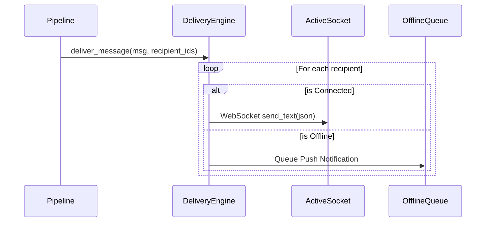

# Delivery Engine

## Overview
The `DeliveryService` (`services/messaging/delivery.py`) is an abstraction layer sitting over FastAPI's raw WebSockets. It replaces the old monolithic `ConnectionManager`.

## Responsibilities
1. **Connection Management**: Maps `user_id` to active `WebSocket` objects.
2. **Dispatching**: Safely loops over sockets to emit payloads.
3. **Offline Handling**: If a user has no active sockets, the delivery engine falls back (conceptually) to Push Notifications.

