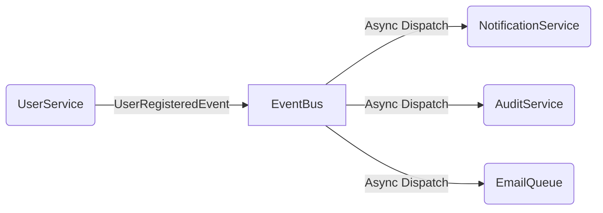

# Event Architecture

## Overview
The Event Bus decouples domain logic. Instead of the `UserService` directly calling the `NotificationService`, it publishes a `UserRegisteredEvent`. The `NotificationService` subscribes to this event.

## Design
- `EventBus`: Central registry and publisher.
- `BaseEvent`: Pydantic base model for strong typing of event payloads.



## Usage
```python
from app.events.types import UserRegisteredEvent
from app.deps import get_event_bus

event_bus = get_event_bus()

# Publishing
await event_bus.publish(UserRegisteredEvent(actor_id=1, payload={"username": "test"}))

# Subscribing
event_bus.subscribe("UserRegistered", my_handler_func)
```
