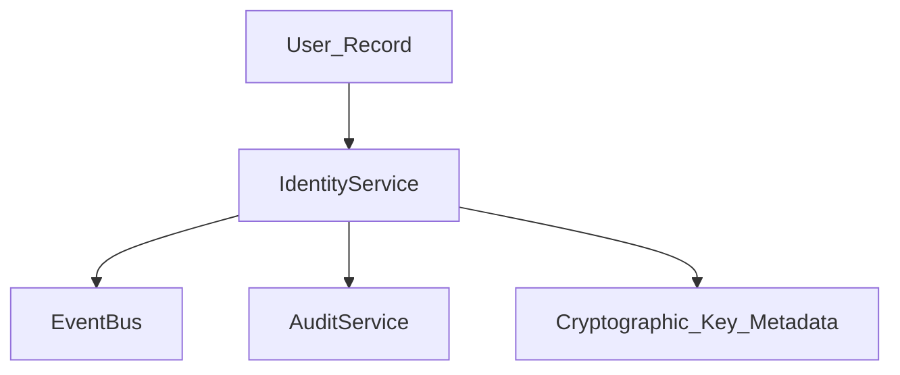

# Identity Architecture

## Overview
The `IdentityService` represents a user's enterprise identity separately from their raw SQL `User` record. It tracks:
- Identity Verification status
- Associated public cryptographic keys
- Audit logs for critical lifecycle events (e.g., password changes, MFA enrollments)

## Key Associations (Phase D Preparation)
To prepare for End-to-End Encryption (Phase E), the Identity model tracks `has_public_key` and `primary_key_id`. This allows users to look up each other's identity status before initiating a secure session.

