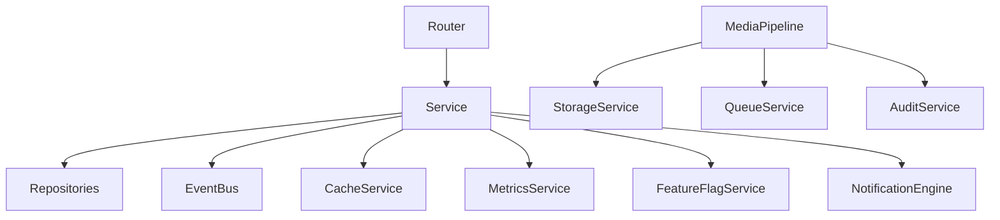

# Enterprise Infrastructure Architecture

This document describes the foundational internal infrastructure established in Phase B. This layer acts as the backbone for all services, providing decoupled, generic abstractions over caching, storage, events, queues, and security.

## Core Modules

### 1. `app/events` (Event Bus)
A synchronous event bus allowing decoupled cross-domain communication.
See [EventArchitecture.md](file:///c:/Users/JAINAM/OneDrive/Desktop/safechat360/backend/EventArchitecture.md)

### 2. `app/audit` (Audit Engine)
Centralized logging for critical actions. The `AuditService` ensures sensitive information is redacted before writing to a secure log stream.

### 3. `app/cache` (Cache Abstraction)
Provides a generic `CacheProvider` interface with a `MemoryCache` implementation. Designed for a seamless switch to Redis in the future.
See [CachingArchitecture.md](file:///c:/Users/JAINAM/OneDrive/Desktop/safechat360/backend/CachingArchitecture.md)

### 4. `app/storage` (Storage Abstraction)
Encapsulates cloud storage operations. Currently implements `SupabaseStorage` with an interface ready for AWS S3 or Cloudflare R2.
See [StorageArchitecture.md](file:///c:/Users/JAINAM/OneDrive/Desktop/safechat360/backend/StorageArchitecture.md)

### 5. `app/notifications` (Notification Engine)
A provider-based dispatcher for multi-channel alerts (In-App, Email, Push).
See [NotificationArchitecture.md](file:///c:/Users/JAINAM/OneDrive/Desktop/safechat360/backend/NotificationArchitecture.md)

### 6. `app/metrics` (Metrics Layer)
Collects runtime operational data (counters and latencies). Extensible to Prometheus/Grafana.

### 7. `app/features` (Feature Flags)
Allows toggling features globally or via percentage rollout based on user ID hashes.
See [FeatureFlags.md](file:///c:/Users/JAINAM/OneDrive/Desktop/safechat360/backend/FeatureFlags.md)

### 8. `app/queue` (Queue Abstraction)
Background job queue interface. Replaces blocking processes with fire-and-forget asynchronous tasks.

### 9. `app/media` (Media Pipeline)
A unified pipeline for handling file uploads, validating mime types, executing virus scans, and extracting metadata, utilizing the queue and storage abstractions.

### 10. `app/security` (Security Services)
Consolidates security measures like header injection, rate limiting abstraction, token blacklisting, and IP/Device intelligence.

### 11. `app/config` (Modular Configuration)
`app/core/config.py` has been split into independent domains (`database`, `storage`, `security`, etc.) to prevent massive monolitic config objects.

## Dependency Injection Graph

