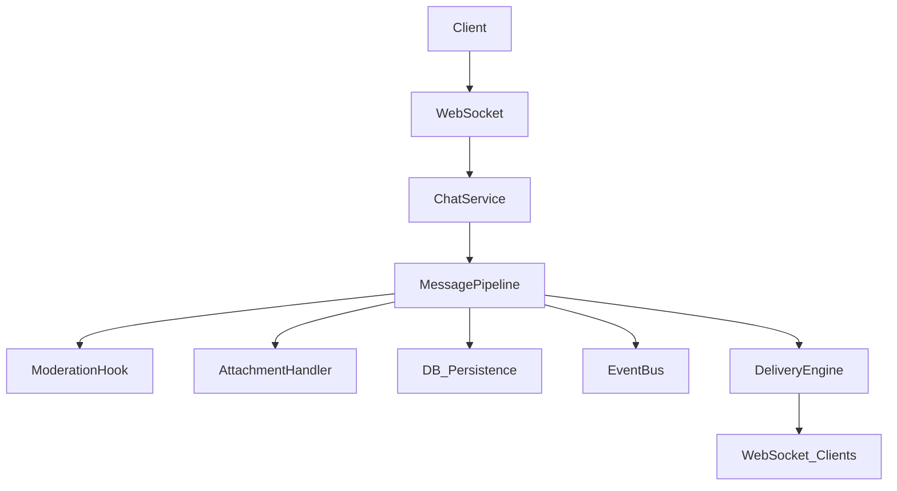

# Messaging Architecture (Phase C)

## Overview
The SafeChat360 Messaging Core has been decoupled into an enterprise-grade pipeline architecture. Rather than dumping WebSocket payloads directly into the database, messages now flow through a 12-stage validation and processing pipeline.

## Components
- **Conversation Domain**: An in-memory resolution of participants (`services/messaging/conversation.py`).
- **Message Pipeline**: The central orchestrator (`services/messaging/pipeline.py`).
- **Message Entity**: Standardized Pydantic models for transit (`services/messaging/entity.py`).
- **Status Lifecycle**: State machine for tracking `Queued` -> `Sent` -> `Delivered` -> `Read`.
- **Delivery Engine**: Abstracts WebSockets and Push Notifications (`services/messaging/delivery.py`).

## Data Flow

