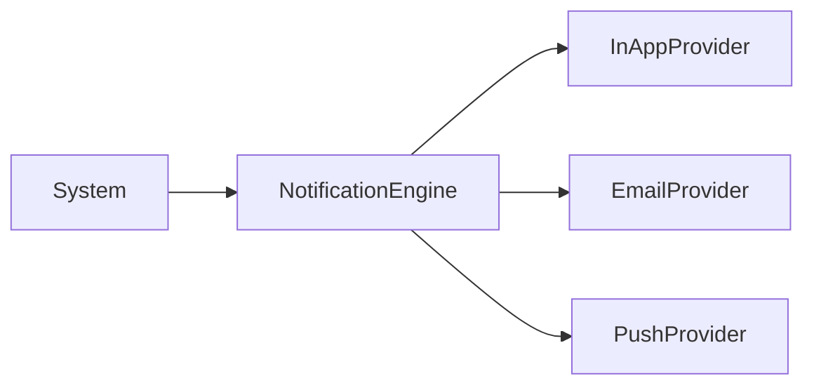

# Notification Architecture

## Overview
The Notification Engine standardizes how the system alerts users across multiple channels simultaneously.

## Design
- `NotificationProvider`: Interface for sending a message to a user.
- Implementations: `InAppProvider`, `EmailProvider`, `PushProvider`, `SMSProvider`.
- `NotificationEngine`: Orchestrator that takes a notification request and multiplexes it across all active providers asynchronously.

