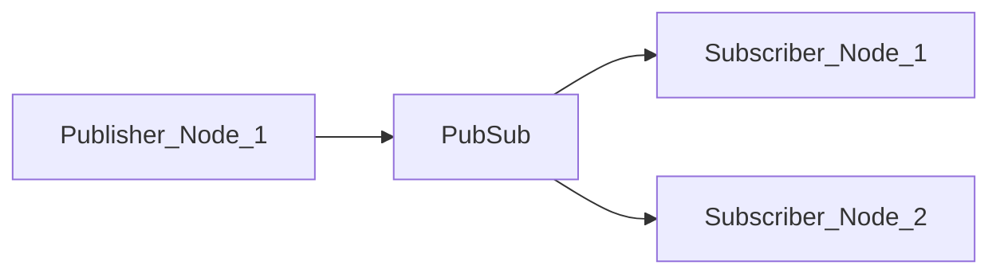

# PubSub Architecture

## Overview
The `PubSubProvider` decouples the producer of a message from the physical socket delivery layer.

## Providers
- **MemoryPubSub**: (Current) Uses `asyncio.gather` to immediately dispatch payloads to registered local callbacks. Ideal for single-node development and unit testing.
- **RedisPubSub**: (Future) Uses Redis channels to broadcast across multiple worker instances.
