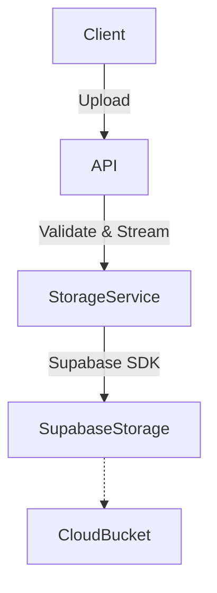

# Storage Architecture

## Overview
The storage layer isolates cloud provider specifics from the core business logic.

## Providers
- `StorageProvider`: Base interface defining `upload`, `download`, `delete`, and `generate_signed_url`.
- `SupabaseStorage`: Implementation tailored for Supabase Storage buckets.

## Service
- `StorageService`: Injected into routers/services. Enforces business rules (file size, mime types) before invoking the underlying provider.

