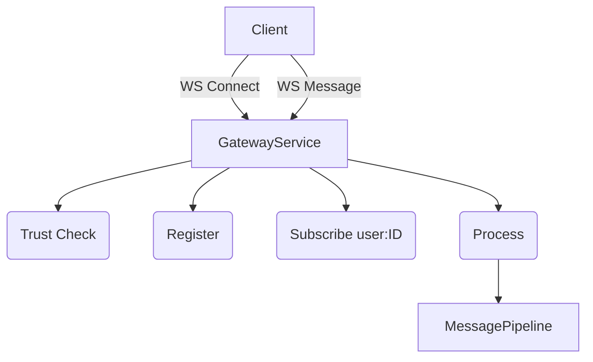

# WebSocket Architecture

## Overview
WebSockets are now isolated inside `GatewayService`.

The Gateway handles `ping/pong` heartbeats, instantly closing connections that fail to respond within a timeout window, preventing stale memory leaks.
