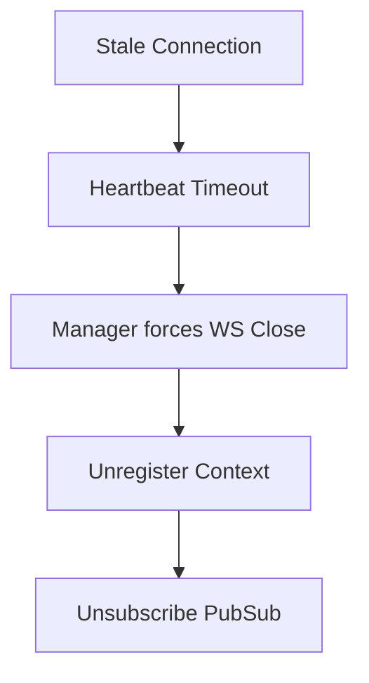

# Connection Lifecycle

1. **Acceptance**: Client requests WS connection. `GatewayService` validates Auth Token, Device ID, and Policies.
2. **Registration**: Connection added to `ConnectionRegistry`.
3. **Subscription**: Gateway subscribes to the user's Pub/Sub channel.
4. **Active State**: Reads messages, delegates to `ChatService`. Processes Heartbeats (Ping/Pong).
5. **Heartbeat Monitoring**: `ConnectionManager` sweeps for stale connections where `last_heartbeat` > threshold.
6. **Termination**: Unregisters from Registry, removes Pub/Sub subscription. Emit `ConnectionClosedEvent`.

## Failure Recovery

