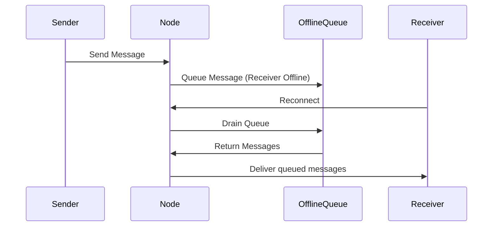

# Delivery Guarantees

SafeChat360 Enterprise enforces the following delivery semantics:
- **Ordered Delivery**: `MessageOrderingService` assigns a sequence number per conversation.
- **Duplicate Suppression**: `MessageOrderingService` tracks seen message IDs within a temporal window (e.g., 5 mins) to prevent duplicate processing.
- **Offline Queueing**: `OfflineMessageService` temporarily stores messages for disconnected users, which are drained upon reconnection.

## Offline Replay

