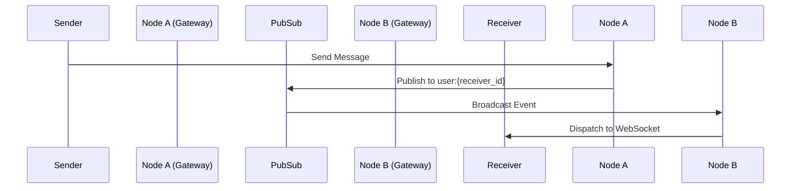

# Distributed Messaging Architecture

## Overview
SafeChat360 Enterprise handles distributed messaging to allow horizontal scaling.
Messages are published to a Pub/Sub provider (currently Memory-based, transitioning to Redis/Kafka). Nodes subscribe to user-specific channels. 
When a message arrives on the Pub/Sub bus, the receiving node pushes it down to any active WebSocket connection for that user on that specific node.

## Delivery Pipeline
1. Client sends message via HTTP or WebSocket.
2. `MessagePipeline` validates, applies moderation, and persists to DB.
3. `DeliveryService` assigns sequence numbers, checks duplicates, and publishes to Pub/Sub channel `user:{recipient_id}`.
4. Each cluster node subscribes to Pub/Sub. The node holding the recipient's WebSocket connection receives the event.
5. `GatewayService` proxies the message to the physical WebSocket connection.

## Diagrams

### Message Routing

