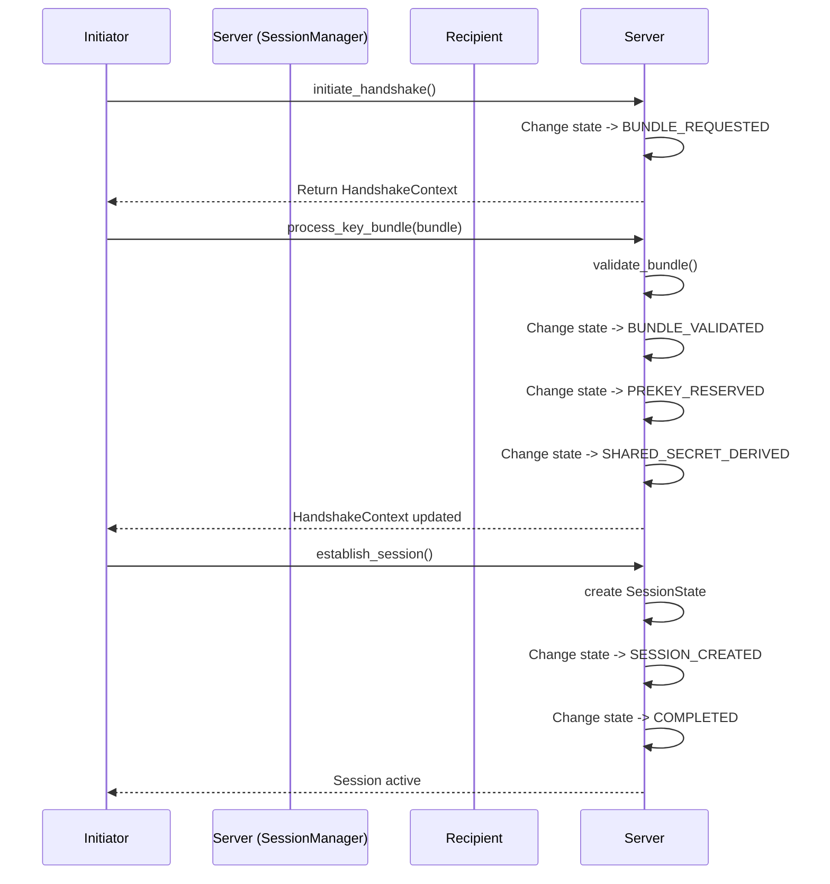

# Handshake Flow

```mermaid
sequenceDiagram
    participant Initiator
    participant Server (SessionManager)
    participant Recipient

    Initiator->>Server: initiate_handshake()
    Server->>Server: Change state -> BUNDLE_REQUESTED
    Server-->>Initiator: Return HandshakeContext
    
    Initiator->>Server: process_key_bundle(bundle)
    Server->>Server: validate_bundle()
    Server->>Server: Change state -> BUNDLE_VALIDATED
    Server->>Server: Change state -> PREKEY_RESERVED
    Server->>Server: Change state -> SHARED_SECRET_DERIVED
    Server-->>Initiator: HandshakeContext updated
    
    Initiator->>Server: establish_session()
    Server->>Server: create SessionState
    Server->>Server: Change state -> SESSION_CREATED
    Server->>Server: Change state -> COMPLETED
    Server-->>Initiator: Session active
```
