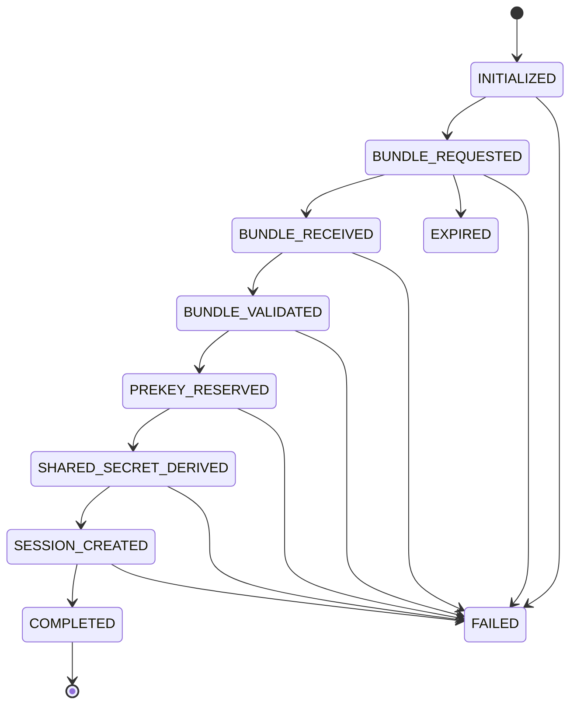

# Handshake State Machine

```mermaid
stateDiagram-v2
    [*] --> INITIALIZED
    INITIALIZED --> BUNDLE_REQUESTED
    BUNDLE_REQUESTED --> BUNDLE_RECEIVED
    BUNDLE_RECEIVED --> BUNDLE_VALIDATED
    BUNDLE_VALIDATED --> PREKEY_RESERVED
    PREKEY_RESERVED --> SHARED_SECRET_DERIVED
    SHARED_SECRET_DERIVED --> SESSION_CREATED
    SESSION_CREATED --> COMPLETED
    COMPLETED --> [*]
    
    INITIALIZED --> FAILED
    BUNDLE_REQUESTED --> EXPIRED
    BUNDLE_REQUESTED --> FAILED
    BUNDLE_RECEIVED --> FAILED
    BUNDLE_VALIDATED --> FAILED
    PREKEY_RESERVED --> FAILED
    SHARED_SECRET_DERIVED --> FAILED
    SESSION_CREATED --> FAILED
```
