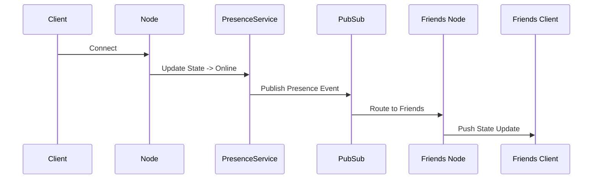

# Presence Cluster

The `PresenceService` broadcasts presence updates (online, offline, idle, typing, etc.) across the distributed cluster via Pub/Sub.

When a user's connection status changes, an event is emitted and broadcast to their friends/groups so all active nodes can notify connected clients.

## Sequence

