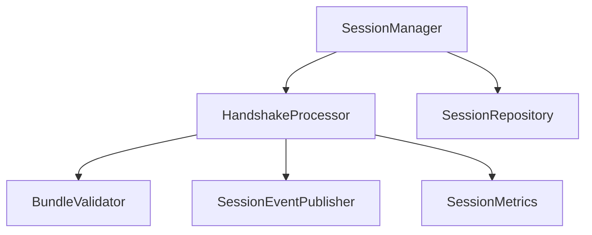

# Session Architecture

The architecture relies on separated components, injecting zero-knowledge dependencies.

- `SessionManager`: Orchestrates handshakes and sessions.
- `HandshakeProcessor`: State engine for the protocol.
- `SessionRepository`: Stores volatile session data.
- `BundleValidator`: Protects against protocol abuse.
- `SessionCryptoProvider`: Handles X25519 and HKDF-SHA256 operations opaquely.

