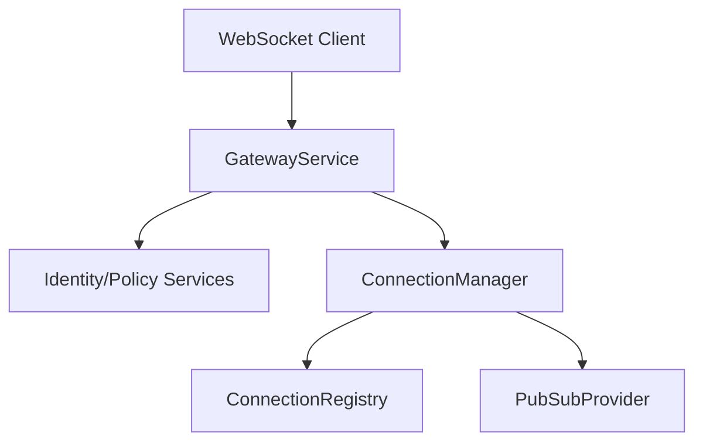

# WebSocket Architecture

## Gateway Service
The Gateway separates the physical WebSocket connection from business logic. It handles authentication, metrics, rate-limiting, heartbeats, and pub/sub bridging.

## Connection Manager
Manages the lifecycle of connections on the local node. Checks for stale connections via a heartbeat monitor.

## Connection Registry
Maintains an in-memory mapping of `user_id` and `device_id` to `ConnectionContext`. 

## Component Diagram

