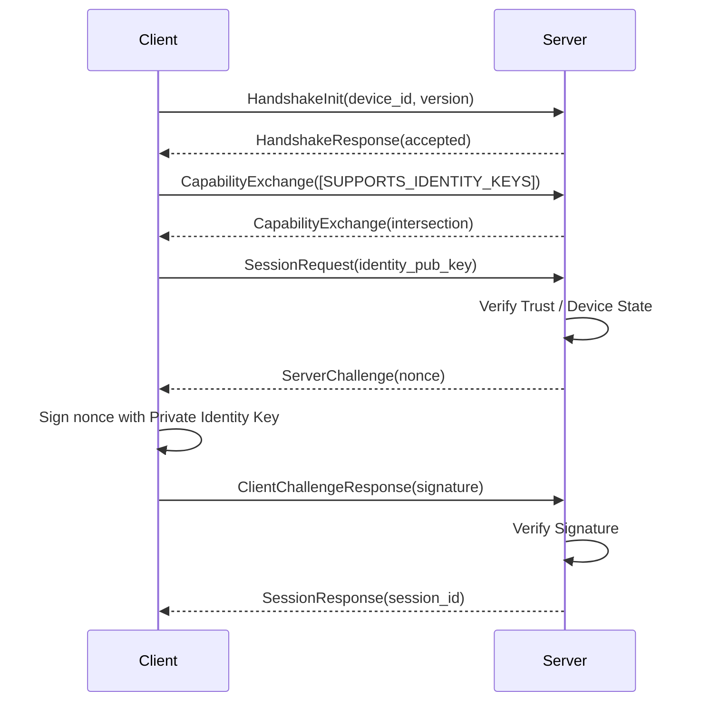

# Handshake Sequence

## The Interaction Model

```mermaid
sequenceDiagram
    participant Client
    participant Server

    Client->>Server: HandshakeInit(device_id, version)
    Server-->>Client: HandshakeResponse(accepted)
    
    Client->>Server: CapabilityExchange([SUPPORTS_IDENTITY_KEYS])
    Server-->>Client: CapabilityExchange(intersection)
    
    Client->>Server: SessionRequest(identity_pub_key)
    Server->>Server: Verify Trust / Device State
    Server-->>Client: ServerChallenge(nonce)
    
    Client->>Client: Sign nonce with Private Identity Key
    Client->>Server: ClientChallengeResponse(signature)
    
    Server->>Server: Verify Signature
    Server-->>Client: SessionResponse(session_id)
```
