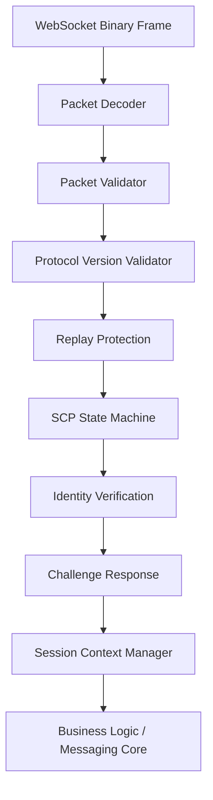

# Protocol Pipeline

## Flow of Execution

```mermaid
graph TD
    A[WebSocket Binary Frame] --> B[Packet Decoder]
    B --> C[Packet Validator]
    C --> D[Protocol Version Validator]
    D --> E[Replay Protection]
    E --> F[SCP State Machine]
    F --> G[Identity Verification]
    G --> H[Challenge Response]
    H --> I[Session Context Manager]
    I --> J[Business Logic / Messaging Core]
```

At any step A through H, if a check fails, a `ProtocolException` is thrown, the connection is instantly closed, and temporary memory is zeroized.
