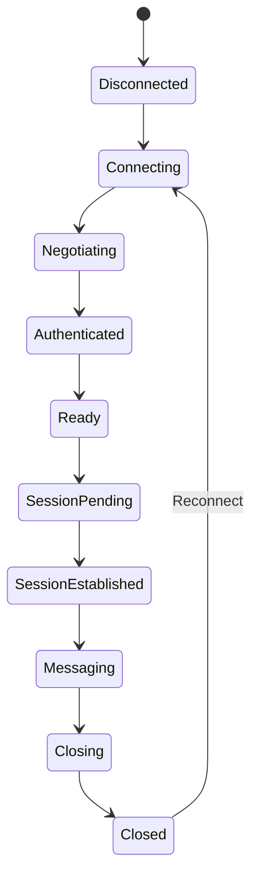

# Protocol State Machine

## Finite State Automaton (DFA)
SCP connections adhere to a strict DFA to prevent sequence attacks and race conditions.

## Security
If a client attempts to send a `MessageEnvelope` while in the `Negotiating` state, the `SCPStateMachine` will immediately throw a `ProtocolViolation` and drop the socket.
